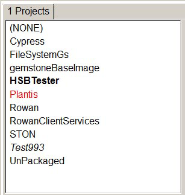

<H1 CLASS="Chapter">
Jadeite Help</H1>
Jadeite is a graphical user interface for code development and debugging, for use with the Rowan code manager within a GemStone environment. For more information, see the Github project. 

<EM CLASS="Italic">This is an incomplete placeholder for help for Jadeite.</EM>

  * [Browser Code status decoration](#browser-code-status-decoration)

### Browser Code status decoration

#### Project status text decoration

The color, weight (bold) and italic font for a Project's name in the Console's Project List or the Projects Browser indicates the status of the Project in the image, vs. the on-disk status. This project information is also available via Hover help and in the Projects Browser Project tab.

###### Example 1.1 Project Pane of a Project Browser

###### 

 

  * Normal font for a Project's name (that is, not red, bold, or italic) indicates that it is loaded, and there are no changes either in the image or on disk.
  * <b>Bold</b> font indicate that the Project has changes in the image that have not been written to disk.
  * <EM CLASS="Italic">Italic</EM> font indicates that the Project is dirty on disk, with respect to the git repository. For example, if you have previously written the project to disk without doing a git commit, the disk is dirty, although the image is clean with respect to the disk. Dirty on disk, however, can also mean that you have edited files on disk, or made changes from Jadeite and not saved your image before restarting.
  * Red font indicates there is <b>skew</b>; the sha on disk does not match the sha loaded into the image. This can result if you checkout a different git tag or branch, from Jadeite or on the git command line, if you perform git commit outside of jadeite on the git command line, or if you are working in a shared repository and do a git pull after another user has committed.

If you see skew, it is generally recommended to refresh from disk to load the current git sha; otherwise, you should avoid making any changes or performing any git commits, to avoid the risk of logical corruption in the git repository.

Jadeite does not currently support git merge; if you have changes and the repository is in skew, you will need to write your changes to disk without commit, and perform a git merge and resolve any conflicts outside of Jadeite.

  * (projectname) When the project name is enclosed in parentheis, it indicates that project does not exist on disk. 

### Class and Method status text decoration

When the Projects Browser displays a Package, it displays a list of all classes that are associated with that Package, and also displays classes that are in other Packages, but have extension methods that are in that Package.

When the Projects Browser displays a Class, it displays a list of all methods that are defined for that class, including methods that are in the selected Package and methods that are defined in other Packages.

  * A class is in normal font and a method in normal font indicate that the Class and method is defined in the selected Package or Packages.
  * If the class is in normal and the method is in purple and underlined , it indicates that the method is defined in a different package; the other package contains an extension method to the selected class.

Use the method pop up menu item Go To Defining Package to see the Package for that method.

##### Class that is not defined in the selected Package

###### Example 1.2 Method Decorations Example

###### 

 

  * A class in purple indicates that the class definition is associated with a different package; the class is included in the list of classes since it has one or more extension methods that are defined in this package. Use the pop up menu item Go To Defining Package to see the Package for that class.

In the example, the selected package holds only extension methods, so all classes in the example are purple (selecting a class masks the purple font, for readability).

  * If the class is in purple and the method is in normal font, it indicates that the method is defined in the same package as the class, and that neither the class nor the definition are in the selected package. The Class and Method pane pop up menu item Go To Defining Package will show the Package for that class/method.

In the example, methods such as asDefinition are in normal font, indicating that they are defined in the same package as its class. The class RwDefinition and the method asDefinition are both defined in the package named Rowan-Definitions, while Rowan-Core-Definitions-Extensions is the selected package.

If the class is in purple and the method is in purple (not underlined), it indicates that the method is defined in the selected package; that is, this is an extension method in the selected package.

The method comparePropertiesAgainstBase: is defined in the package Rowan-Core-Definitions-Extensions, which is the selected package, but not the package that its class is defined in.

If the class is in purple and the method is in purple and underlined , it indicates that the method is defined in a third package, neither the selected package nor the package that the class is defined on. Use the method pop up menu item Go To Defining Package to see the Package for that method.

The method diffSton: is defined in another package, Rowan-Core-Definitions-Extensions-37; neither the selected package, nor its class's package.

 

